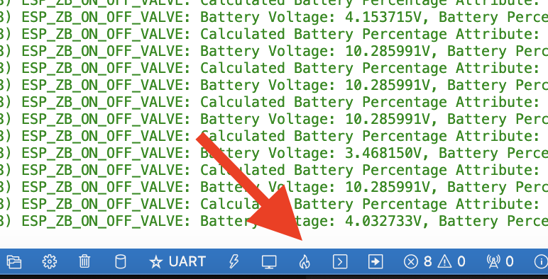

| Supported Targets | ESP32-C6 | ESP32-H2 |
| ----------------- | -------- | -------- |

# Bachelor Thesis Elias Tilegant
## Code for Zigbee remote valve control

### Settings for build with ESP-IDF VSCode:
- Target = esp32c6
- Port = depending on your system
- Flash-Mode = depends, usually UART

### Steps to flash:
1.  Click on the flame emoji in your VS code toolbar

2.  Thats it! Watch the output, it should automatically change to the ESP SI

(See example.log and build.log for example logs)

Fork based on:
* [ESP Zigbee SDK Repo](https://github.com/espressif/esp-zigbee-sdk/tree/main/examples/esp_zigbee_HA_sample/HA_on_off_light)